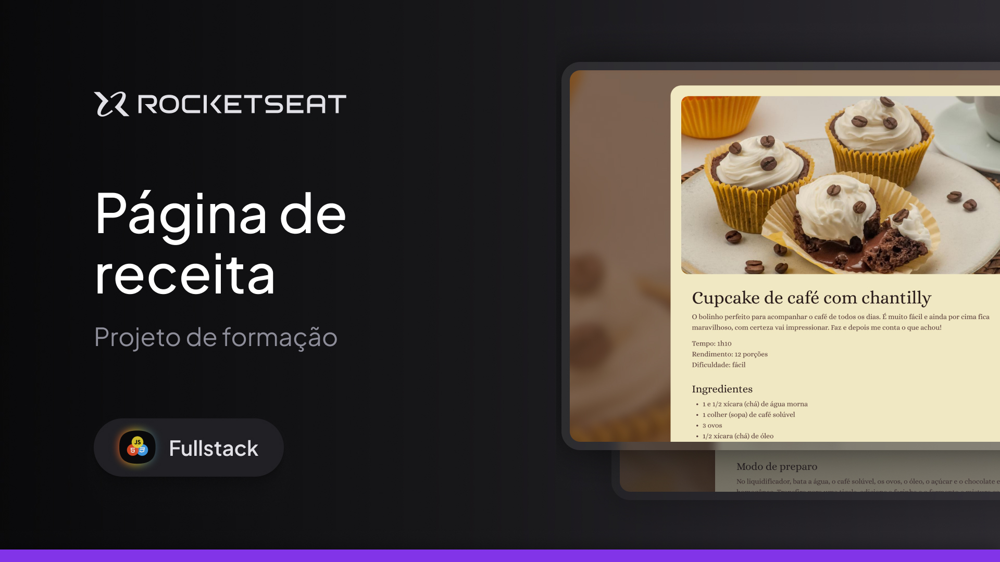

<h1 align="center">Página de Receita</h1>

**Descrição breve do projeto**:

"Nesse projeto você vai desenvolver uma página simples de receita.

Esse é um dos projetos desenvolvidos em aula na formação Full-stack, um de nossos conteúdos de especialização.

"Este é um site estático desenvolvido em HTML e CSS para Desenvolver o que foi aprendido em aula, durante os módulos:"

- Fundamentos do HTML
- Fundamentos do CSS
- Introdução ao Git e ao GitHub

---

## Índice

- [Visualização](#visualização)
- [Tecnologias Utilizadas](#tecnologias-utilizadas)
- [Licença](#licença)

---

## Visualização

Se o projeto estiver hospedado online, inclua um link para visualização ao vivo:

🔗 [Clique aqui para acessar o site](https://viniciusalmeida-dev.github.io/Pagina-de-receita/)

---

## Tecnologias Utilizadas

HTML5: Estruturação do conteúdo.

CSS3: Estilização.

Git e GitHub: Controle de versão e hospedagem.

## Licença

Este projeto está licenciado sob a Licença MIT.
